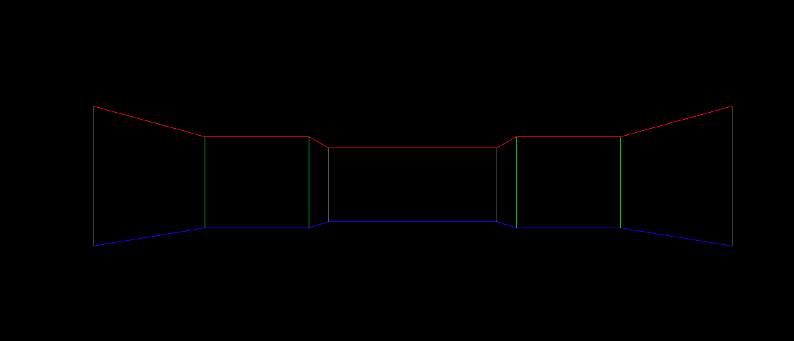
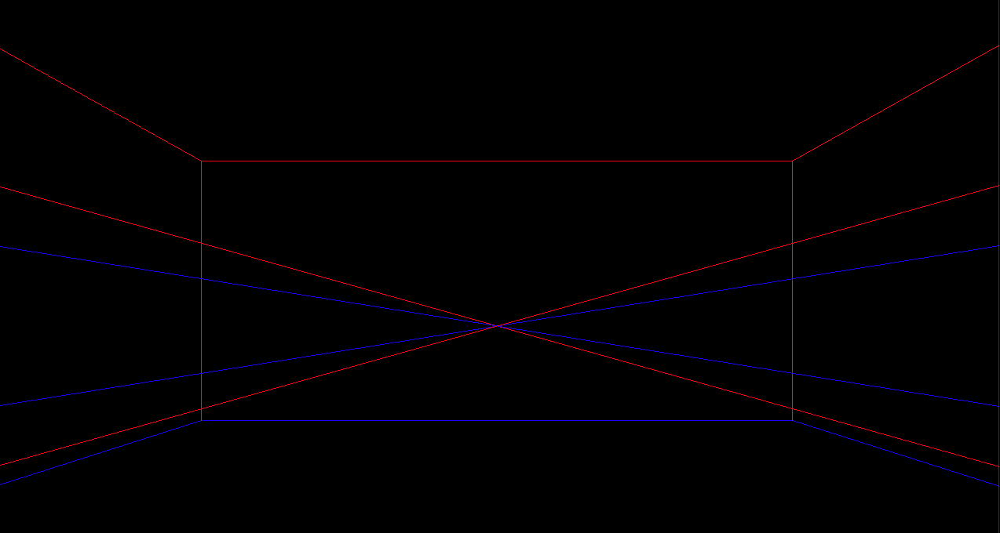

# Pseudo 3D FPS

### Wireframe Outline

Prvotní implemntace kreslí chodby pomocí čar - tzv. _wireframe mode_:



Každá zeď je definnovaná shora jako body v souřadnicích x, z v modulu `world.py`:

```python
 self.walls = [
            Wall(-1.0,  2.0, 1.0, 2.0),
            Wall(-1.0,  1.0, -1.0, 2.0),
            Wall(1.0, 1.0, 1.0, 2.0),
            Wall(-1.0, 1.0, -2.0, 1.0),
            Wall(1.0, 1.0, 2.0, 1.0),
            Wall(-2.0, 1.0, -2.0, -.5),
            Wall(2.0, 1.0, 2.0, -.5)
        ]
```

Následně se z techto souřadnic shora vytvoří zdi ve 3D prostoru v modulu `wall.py`:
```python
 def __init__(self, x1, z1, x2, z2):
        self.p1 = Point3d(x1, -0.4, z1)
        self.p2 = Point3d(x2, -0.4, z2)
        self.p3 = Point3d(x2, 0.7, z2)
        self.p4 = Point3d(x1, 0.7, z1)
```

t.j. zeď má základnu ve výšce -0.4 a nejvyšší bod ve výšce 0.7. Každý bod ve 3D je tranformován na obrazovku v modulu `transform.py`:

```python
    def screen(self, screen_size):
        sx = screen_size[0] / 2
        sy = screen_size[1] / 2
        f = 1.0
        xx = self.x * f / (self.z + f)
        yy = self.y * f / (self.z + f)

        xx *= sx
        yy *= sy
        return sx + xx, sy - yy
```

Kamera je definovaná jako point of view pomocí pozice a směru pohledu:

```python
class Pov(object):
    def __init__(self):
        self.position = Point3d(0.0, 0.0, 0.0)
        self.direction = Point3d(0.0, 0.0, 1.0)

```

Pro transformaci se použije metoda `Point3D.transform()` v modulu `transform.py`

### Clipping - neboli ořez

Pro ořezání se používá metoda `Line.clip()` v modulu `transform.py`. Bez ořezání osou z bychom viděli artefakty podobné zde:


